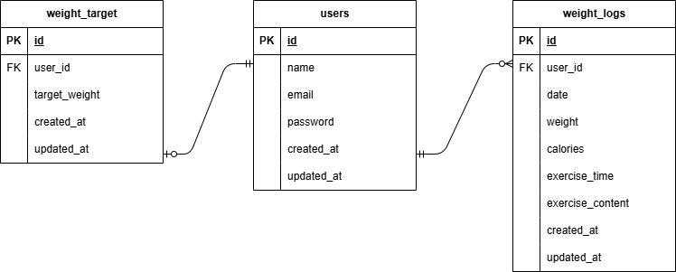

# PiGLy

## 環境構築

1. git clone git@github.com:a-nojiri/pigly-test-3.git
2. DockerDesktopアプリを立ち上げる
3. docker-compose up -d --build
   
   ＊MySQLは、OSによって起動しない場合があるのでそれぞれのPCに合わせてdocker-compose.ymlファイルを編集して下さい。
4. docker-compose exec php bash(コンテナ内に入る)
5. composer install
6. 「.env.example」ファイルを 「.env」ファイルに命名を変更。または、新しく.envファイルを作成
7. `.env`に以下の環境変数を追加
    ```dotenv
   DB_CONNECTION=mysql
   DB_HOST=mysql
   DB_PORT=3306
   DB_DATABASE=laravel_db
   DB_USERNAME=laravel_user
   DB_PASSWORD=laravel_pass
    
8. php artisan key:generate
9. php artisan migrate
10. php artisan db:seed
   
## 使用技術(実行環境)

 ･ PHP 8.0  
 
 ･ Laravel 8.x  
 
 ･ MySQL 8.0  
 
 ･ Docker  
 
 ･ Nginx  

## テストユーザー
- Email: test4@example.com
- Password: password123

 ## ER図
  　　
 

 ## URL
 
・ 開発環境：http://localhost/  

・ phpMyAdmin：http://localhost:8080/　

### 画面URL
- 会員登録（STEP1）: http://localhost/register/step1
- 体重データ入力（STEP2）: http://localhost/register/step2  
- ログイン: http://localhost/login
- 体重管理画面: http://localhost/weight_logs  


